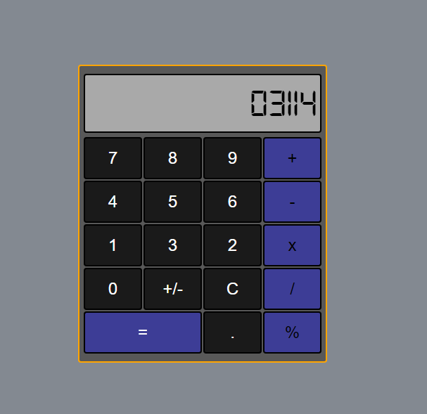

# Calculator

Simple calculator with 4 basic operations (addition, subtraction, multiplication, and division) as well as
support for floating point and percentages 

## Instructions

<ol>
<li>Clone Repository or download code as zip</li>
<li>Open index.html file</li>
<li>Start calculating</li>
</ol>

## Some things to note

<ul> 
<li>The memory will only remember the last operation pressed, e.g. if you put the number 32 and press 'x', then a different operation,
    the operation 32 * 32 will take place  
</li>
<li>Dividing by 0 will give you infinity and you will need to clear the memory in order to use the calculator again</li>
<li>The calculator only supports up to 9 significant digits</li>
</ul>

